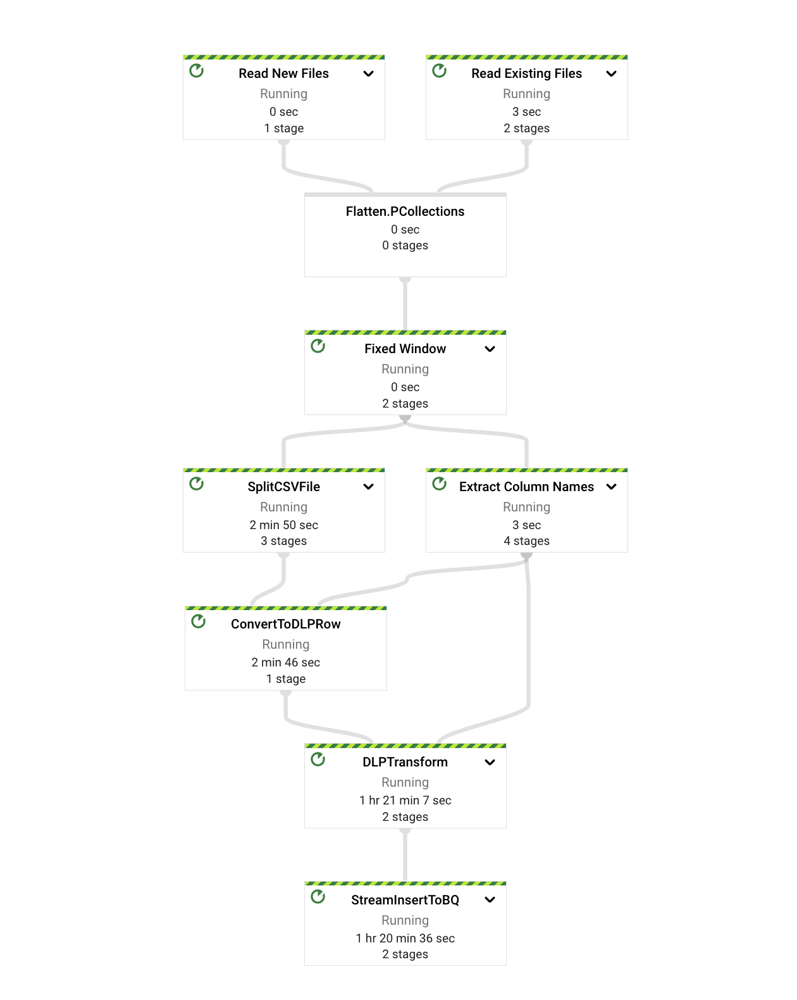

# Inspect, De-identify and Re-identify sensitive data using Cloud DLP and Dataflow

> This repo contains a reference implementation of an end to end data tokenization solution. The solution is designed to migrate sensitive data to BigQuery after passing it through inspection/de-identification/re-identification Dataflow pipelines implemented using Cloud DLP. Please check out the links below for reference guides.

## Table of Contents

* [Reference Architecture](#reference-architecture)

* [Concepts](#concepts)

* [Tutorial](#tutorial)

	* [Pre-requisites](#pre-requisites)
	* [Build and Run](#build-and-run-v2-solution-by-using-in-built-java-beam-transform)
    * [Inspection](#inspection)
    * [De-identification](#de-identification)
    * [Re-identification](#re-identification-from-bigquery)
    * [Pipeline Parameters](#pipeline-parameters)
    * [Supported File Formats](#supported-file-formats)
    * [S3 Scanner](#s3-scanner)

* [How to adapt this pipeline for your use cases](#how-to-adapt-this-pipeline-for-your-use-cases)

* [Troubleshooting](#troubleshooting)

* [Advanced Topics](#advanced-topics)

* [Disclaimer](#disclaimer)


## Reference Architecture


## Concepts

1. [Cloud Data Loss Prevention - Quick Start & Guides](https://cloud.google.com/dlp/docs/dlp-bigquery)
2. [De-identification and re-identification of PII in large-scale datasets using Cloud DLP](https://cloud.google.com/solutions/de-identification-re-identification-pii-using-cloud-dlp).
3. [Create & Manage Cloud DLP Configurations](https://cloud.google.com/dlp/docs/creating-job-triggers).
4. [Automated Dataflow Pipeline to De-identify PII Dataset](https://cloud.google.com/dataflow/docs/guides/templates/provided/dlp-text-to-bigquery).
5. [Validate Dataset in BigQuery and Re-identify using Dataflow](https://cloud.google.com/solutions/validating-de-identified-data-bigquery-re-identifying-pii-data).
6. [Inspecting storage and databases for sensitive data](https://cloud.google.com/dlp/docs/inspecting-storage)
7. [Dataflow Pipeline Options](https://cloud.google.com/dataflow/docs/reference/pipeline-options)
8. [Cloud DLP Quotas and Limits](https://cloud.google.com/dlp/limits)


## Tutorial

### Pre-requisites

1. Create a new project on Google Cloud Platform.

2. Use the link below to open Google Cloud Shell.

   [](https://console.cloud.google.com/cloudshell/editor?cloudshell_git_repo=https://github.com/GoogleCloudPlatform/dlp-dataflow-deidentification.git)

3. Run the following commands to trigger an automated deployment in your GCP project. 

```
gcloud config set project <project_id>
sh deploy-data-tokeninzation-solution-v2.sh
```

Script (deploy-data-tokeninzation-solution-v2.sh) handles following topics:

* Create a service account for running the DLP pipeline (creates a custom role).

* Emit a set_env.sh that can be used to set temporary environment variables while triggering the DLP pipelines.

* Create a bucket ({project-id}-demo-data) in us-central1 and [uploads a sample dataset](http://storage.googleapis.com/dataflow-dlp-solution-sample-data/sample_data_scripts.tar.gz) with <b>mock</b> PII data.

* Create a BigQuery dataset in US (demo_dataset) to store the tokenized data.

* Create a [KMS wrapped key(KEK)](https://cloud.google.com/kms/docs/envelope-encryption) by creating an automatic [TEK](https://cloud.google.com/solutions/de-identification-re-identification-pii-using-cloud-dlp#token_encryption_keys) (Token Encryption Key).

* Create DLP [inspect, de-identification and re-identification templates](https://cloud.google.com/solutions/creating-cloud-dlp-de-identification-transformation-templates-pii-dataset#creating_the_cloud_dlp_templates) with the KEK and crypto based transformations identified in this [section of the guide](https://cloud.google.com/solutions/de-identification-re-identification-pii-using-cloud-dlp#determining_transformation_type)

Please allow 5-10 mins for the deployment to be completed.

You can run some quick [validations](https://cloud.google.com/solutions/validating-de-identified-data-bigquery-re-identifying-pii-data#validating_the_de-identified_dataset_in_bigquery) in BigQuery table to check on tokenized data.

For re-identification (getting back the original data in a Pub/Sub topic), please follow this instruction [here](https://cloud.google.com/solutions/validating-de-identified-data-bigquery-re-identifying-pii-data#re-identifying_the_dataset_from_bigquery).


### Build and Run (V2 Solution By Using In Built Java Beam Transform)

This part of the repo provides a reference implementation to process large scale files for  any DLP transformation like Inspect, Deidentify or ReIdentify.  Solution can be used for CSV / Avro files stored in either GCS or AWS S3 bucket. It uses State and Timer API for efficient batching to process the files in optimal manner.

```
gradle spotlessApply

gradle build
```

### Inspection

```
gradle run -DmainClass=com.google.swarm.tokenization.DLPTextToBigQueryStreamingV2 -Pargs=" --region=<region> --project=<projct_id> --streaming --enableStreamingEngine --tempLocation=gs://<bucket>/temp --numWorkers=1 --maxNumWorkers=2 --runner=DataflowRunner --filePattern=gs://<path>.csv --dataset=<name>   --inspectTemplateName=<inspect_template> --deidentifyTemplateName=<deid_tmplate> --DLPMethod=DEID"
```

### De-Identification

```
gradle run -DmainClass=com.google.swarm.tokenization.DLPTextToBigQueryStreamingV2 -Pargs=" --region=<region> --project=<projct_id> --streaming --enableStreamingEngine --tempLocation=gs://<bucket>/temp --numWorkers=1 --maxNumWorkers=2 --runner=DataflowRunner --filePattern=gs://<path>.csv --dataset=<name>   --inspectTemplateName=<inspect_template> --deidentifyTemplateName=<deid_tmplate> --DLPMethod=DEID"
```

### Re-Identification From BigQuery

You can. use the pipeline to read from BgQuery table and publish the re-identification data in a secure pub sub topic.

Export the Standard SQL Query to read data from bigQuery
One example from our solution guide:
```
export QUERY="select ID,Card_Number,Card_Holders_Name from \`${PROJECT_ID}.${BQ_DATASET_NAME}.100000CCRecords\` where safe_cast(Credit_Limit as int64)>100000 and safe_cast (Age as int64)>50 group by ID,Card_Number,Card_Holders_Name limit 10"
```
Create a gcs file with the query:

```
export GCS_REID_QUERY_BUCKET=<name>
cat << EOF | gsutil cp - gs://${REID_QUERY_BUCKET}/reid_query.sql
${QUERY}
EOF
```
Run the pipeline by passing required parameters:
```
gradle run -DmainClass=com.google.swarm.tokenization.DLPTextToBigQueryStreamingV2 -Pargs="--region=<region> --project=<project_id> --streaming --enableStreamingEngine --tempLocation=gs://<bucket>/temp --numWorkers=5 --maxNumWorkers=10 --runner=DataflowRunner --tableRef=<project_id>:<dataset>.<table> --dataset=<dataset> --topic=projects/<project_id>/topics/<name> --autoscalingAlgorithm=THROUGHPUT_BASED --workerMachineType=n1-highmem-4 --deidentifyTemplateName=projects/<project_id>/deidentifyTemplates/<name> --DLPMethod=REID --keyRange=1024 --queryPath=gs://<gcs_reid_query_bucket>/reid_query.sql"

```

### Pipeline Parameters

### Supported File Formats

1. AVRO
2. JSONL
3. TSV
4. CSV


### S3 Scanner

```
export AWS_ACCESS_KEY="<access_key>"
export AWS_SECRET_KEY="<secret_key>"
export AWS_CRED="{\"@type\":\"AWSStaticCredentialsProvider\",\"awsAccessKeyId\":\"${AWS_ACCESS_KEY}\",\"awsSecretKey\":\"${AWS_SECRET_KEY}\"}"
```
```
gradle spotlessApply

gradle build

// inspect is default as DLP Method; For deid: --DLPMethod=DEID
gradle run -DmainClass=com.google.swarm.tokenization.DLPTextToBigQueryStreamingV2 -Pargs="--region=<region> --project=<project_id> --streaming --enableStreamingEngine --tempLocation=gs://<bucket>/temp --numWorkers=1 --maxNumWorkers=2 --runner=DataflowRunner --filePattern=s3://<bucket>>/file.csv --dataset=<name>  --inspectTemplateName=<inspect_template> --deidentifyTemplateName=<deid_tmplate> --awsRegion=<aws_region> --awsCredentialsProvider=$AWS_CRED"
```

## How to adapt this pipeline for your use cases

1. Create your own inspection templates
2. Run inspection on a sample data
3. Create De-id templates and run pipeline
4. Stream new files to input folder.

## Troubleshooting

Give instructions on where to look for error in logs. The pipeline handles transient errors.

Following are the known issues with Cloud DLP, along with ways you can avoid or recover from them.

BigQuery Scanning: Issues common to inspection & de-identification operations in BigQuery

1. Duplicate Rows: When writing data to a BigQuery table, Cloud DLP might write duplicate rows.

## Advanced topics

## Disclaimer

## Dataflow DAG

For Deid and Inspect:




For Reid:


## Trigger Pipeline Using Public Image
You can use the gcloud command to trigger the pipeline using Dataflow flex template. Below is an example for de-identification transform from a S3 bucket.

```
gcloud beta dataflow flex-template run "dlp-s3-scanner-deid-demo" --project=<project_id> \
--region=<region> --template-file-gcs-location=gs://dataflow-dlp-solution-sample-data/dynamic_template_dlp_v2.json \
--parameters=^~^streaming=true~enableStreamingEngine=true~tempLocation=gs://<path>/temp~numWorkers=5~maxNumWorkers=5~runner=DataflowRunner~filePattern=<s3orgcspath>/filename.csv~dataset=<bq_dataset>~autoscalingAlgorithm=THROUGHPUT_BASED~workerMachineType=n1-highmem-8~inspectTemplateName=<inspect_template>~deidentifyTemplateName=<deid_template>~awsRegion=ca-central-1~awsCredentialsProvider=$AWS_CRED~batchSize=100000~DLPMethod=DEID

```
## To Do
- take out first row as header before processing 
